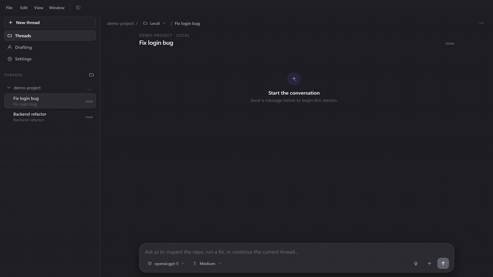
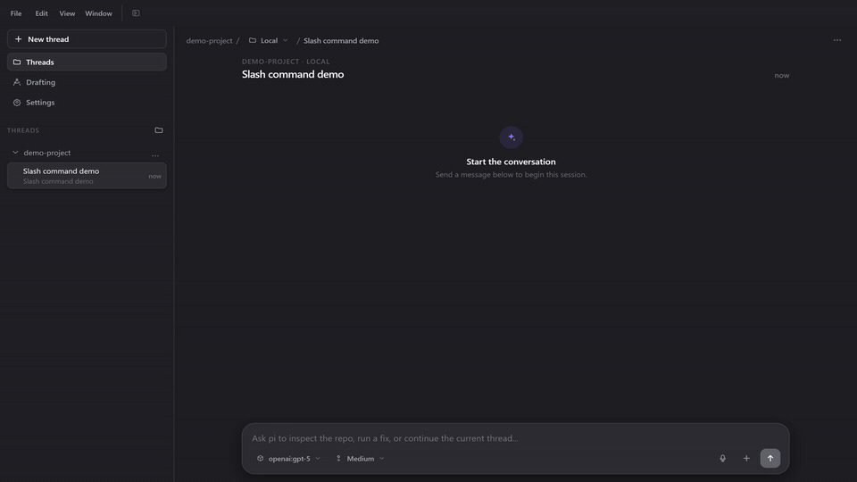

# pi-frame

A powerful, Codex-style Electron desktop workspace for the [`pi`](https://github.com/earendil-works/pi) coding agent.

[](./apps/desktop/package.json)
[](./LICENSE)
[](#install)

`pi-frame` brings long-running agent workflows into a native, high-performance Electron desktop environment: persistent conversation timelines, isolated Git worktrees, parallel agent execution, visual diffs, integrated terminals, browser automation, Computer Use, and custom provider/model settings—all unified without replacing or forking the upstream `pi` agent runtime.



## Highlights

| Parallel sessions | Commands and model controls |
| --- | --- |
|  |  |

- **Conversation-first workspace**: Persistent timelines, collapsible tool calls, prompt queuing, transcript search, and crash recovery.
- **Parallel work without collisions**: Local threads, per-thread Git worktrees, branching/forking, and multi-agent coordination.
- **Code review in context**: Integrated terminal (xterm.js), repository tree explorer, inline visual diffs, file mentions (`@`), and image attachments.
- **Built-in browser and Computer Use**: Agent-driven browsing with DevTools integration and desktop OS interaction on macOS and Windows.
- **Native desktop ergonomics**: Light and dark themes, configurable keybindings, desktop notifications, and offline voice input.
- **Upstream-compatible runtime**: Uses `pi` JSONL sessions, providers, models, skills, extensions, and authentication as the authoritative source of truth.

## Screenshots

| Conversation timeline | Inline diff |
| --- | --- |
|  |  |

| Integrated terminal | Light theme |
| --- | --- |
|  |  |

## Quick Start

1. Launch `pi-frame` and add a local repository as a workspace.
2. Open **Settings -> Providers** and connect a provider supported by `pi` (Anthropic, OpenAI, OpenRouter, Ollama, custom OpenAI-compatible endpoints, etc.).
3. Create a **Local** thread or an isolated **Worktree** thread.
4. Choose a model and send a prompt. Existing `pi` authentication and JSONL sessions remain fully compatible.

## Development

### Prerequisites

- Node.js 20+
- pnpm 10.25.0 (managed via `corepack`)
- Platform prerequisites described in [`apps/desktop/README.md`](./apps/desktop/README.md)

### Setup & Run

```bash
corepack enable
pnpm install
pnpm dev
```

### Common Commands

```bash
pnpm build         # Build all packages and desktop app
pnpm typecheck     # Typecheck all workspaces
pnpm lint          # Lint all workspaces
pnpm test          # Run affected Playwright tests
pnpm test:all      # Run complete default test suite
pnpm package:win   # Package Windows installer and portable builds
pnpm package:mac   # Package macOS DMG/ZIP
pnpm package:linux # Package Linux AppImage
```

## Architecture

```text
apps/desktop                 Electron main, preload, React renderer, and Playwright tests
apps/website                 Project website and landing page
packages/pi-sdk-driver       Thin adapter over the upstream pi runtime
packages/session-driver      Shared session interfaces and durable state contracts
packages/catalogs            Workspace and session catalog management
```

- **Strict Boundary**: The renderer has no broad Node.js access. A narrow, typed IPC bridge connects the React UI to Electron main.
- **Thin Driver Layer**: `packages/pi-sdk-driver` acts as a thin bridge over `@earendil-works/pi-coding-agent`, preserving `pi` runtime behavior.
- **Authoritative Storage**: JSONL session files in the `.pi` directory remain the single source of truth for session history.

## Lineage & Acknowledgments

`pi-frame` is built upon the incredible work of the open-source community. We gratefully and ethically acknowledge:

1. **[`pi-gui`](https://github.com/minghinmatthewlam/pi-gui)** — Created by **[Matthew Lam](https://github.com/minghinmatthewlam)**. `pi-gui` pioneered the original Electron GUI, desktop workspace layout, and foundational session interaction model for the `pi` agent.
2. **[`pi-desktop`](https://github.com/mshen6666/pi-desktop)** — Maintained and expanded by **[mshen6666](https://github.com/mshen6666)**. `pi-desktop` contributed major product evolutions, Windows Computer Use desktop automation, offline voice input, worktree orchestration, and extensive packaging workflows.
3. **[`pi`](https://github.com/earendil-works/pi)** — Created by **[Earendil Works](https://github.com/earendil-works)**. The upstream `pi` coding agent runtime (`@earendil-works/pi-coding-agent`) provides the core agent execution engine, tool interfaces, provider architecture, and skill system.

`pi-frame` maintains full compatibility with upstream `pi` session formats and provider contracts while continuing to evolve the desktop experience.

## Compatibility identifiers

The packaged macOS notification helper keeps its historical `pi-gui-notification-status-helper` filename because native notification registration and upgrade compatibility depend on that identifier. Session attachment markers, browser markers, lease surface values, the default catalog path (`~/.pi-gui/catalogs.json`), and existing main/preload IPC channel strings retain their historical names for persisted/protocol compatibility; they are not current product branding.

## Contributing

See [CONTRIBUTING.md](./CONTRIBUTING.md) and [PROJECT_DESCRIPTION.md](./PROJECT_DESCRIPTION.md). Desktop changes must be verified on the real Electron surface using the appropriate Playwright test lane.

## License

Distributed under the [MIT License](./LICENSE). See [LICENSE](./LICENSE) and individual package notices for copyright and upstream attribution details.
